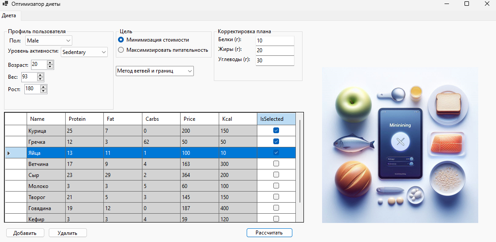
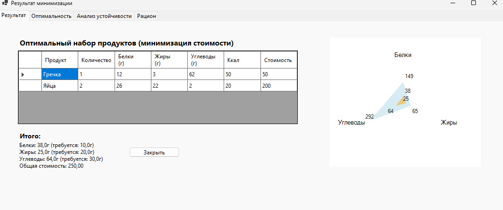
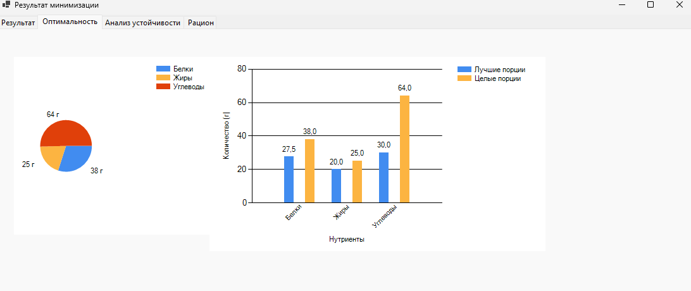
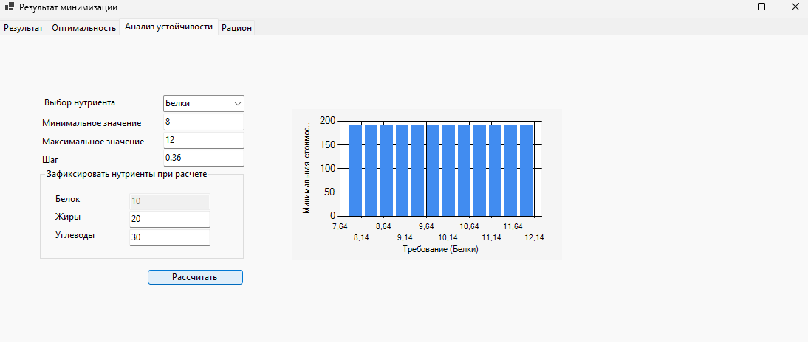
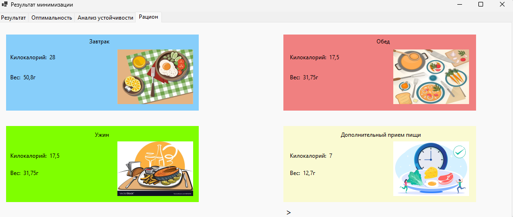

## DietOptimizer
**DietOptimizer** — десктопное приложение на **C# .NET 8**, решающее задачу оптимизации калорий и составления плана диеты в соответствии с профилем пользователя.  

В качестве математической базы используются методы линейного программирования:
- **Симплекс-метод**
- **Метод ветвей и границ**
- **Метод Гомори**

Приложение также выполняет **анализ устойчивости найденного решения**, позволяя оценить, насколько результат изменится при варьировании ограничений.

---

## Стек технологий
```md
- C# .NET 8
- WinForms
- OR-Tools (для варианта решения задачи)
```
## Структура проекта
```md
── DietOptimizer
│   ├── Models
│   │   ├── Enums.cs
│   │   ├── Product.cs
│   │   ├── SolutionResult.cs
│   │   └── UserProfile.cs
│   ├── Solvers
│   │   ├── IntegerSimplexSolver.cs
│   │   ├── IntegerSimplexSolverGomori.cs
│   │   ├── LpSimplexSolver.cs
│   │   └── OrToolsLpSolver.cs
│   ├── UI
│   │   ├── AddProductForm.cs
│   │   ├── MainForm.cs
│   │   ├── ResultForm.cs
│   ├── DietOptimizer.csproj
│   └── Program.cs
└──  DietOptimizer.sln
```

## Основной функционал

- Создание профиля пользователя (возраст, пол, калорийность).
- Подбор оптимального рациона из доступных продуктов.
- Выбор метода решения (симплекс, ветви и границы, Гомори).
- Проведение анализа устойчивости для проверки корректности решения.
- Формирование итогового отчета о рационе.

## Скриншоты интерфейса
- Вкладка «Главная»

- Вкладка «Результат»

- Вкладка «Оптимальность»

- Вкладка «Анализ устойчивости»

- Вкладка «Рацион»


## Математическая база
- Симплекс-метод — решение задачи линейного программирования.
- Метод ветвей и границ — решение целочисленных задач.
- Метод Гомори — улучшение точности целочисленных решений.
- Анализ устойчивости — исследование допустимых диапазонов изменения коэффициентов.

